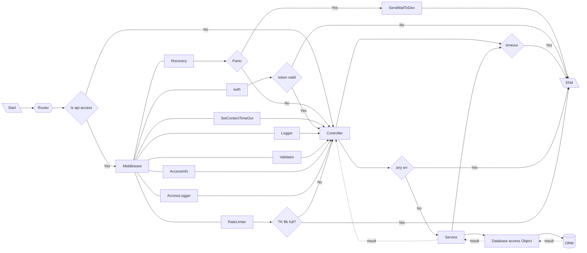

# Blog API -aim: Learning Server Design and learn more about gin


---

**Tool**

*   Golang
*   Gin-Gonic
*   Gorm
*   Mysql
*   jwt-go
*   gomail
*   viper
*   swagger-api
*   rate limiter
*   validator v10

---

**File Structure**

```text
blog-api
|-config - # Configuration file
|-docs - # Document set
|-global - # Global Variable
|-internal - # internal Component
|	|-dao - # database access object. Used to
|	|-middleware - # Middleware component -HTTP middleware
|	|-modle - # database model - Model layer
|	|-router - # server router component and its logic
|	|-serive - # Main Service Login 
|-pkg - # Project relevant package
|-scripts - # Project tempelate file generated by project
|-storage - # Project scripts included building scriptes , install scriptes,analysis scriptes etc...
|-third_party - # 3rd package that project used
```

---

**Restful API**

| Function            | Method | Path      |
| ------------------- | ------ | --------- |
| Add specific Tag    | POST   | /tags     |
| Delete specific Tag | DELETE | /tags/:id |
| Update specific Tag | PUT    | /tags/:id |
| Get Tag List        | GET    | /tags     |

| Function                 | Method | Path          |
| ------------------------ | ------ | ------------- |
| Add Articles             | POST   | /articles     |
| Delete specific Articles | DELETE | /articles/:id |
| Update specific Articles | PUT    | /articles/:id |
| Get specific Articles    | GET    | /articles/:id |

---

**Project Architecture**



---

---

**Project Detail And Implementation(Note)**

#### `Entry Point - main.go`

``` go
func main() {
	//using the config setting variable that have loaded from yaml file
	gin.SetMode(global.ServerSetting.RunMode)
	route := routers.NewRoute()
	//ignore API First
	//if gin.Mode() == gin.DebugMode {
	//	route.GET("/swagger/*any", ginSwagger.WrapHandler(swaggerFile.Handler))
	//}
	server := http.Server{
		Addr:           fmt.Sprintf("127.0.0.1:%s", global.ServerSetting.HttpPort),
		Handler:        route,
		ReadTimeout:    10 * time.Second,
		WriteTimeout:   10 * time.Second,
		MaxHeaderBytes: 1 << 20,
	}
	log.Fatalln(server.ListenAndServe())
}
```

` Setting initial function of the entry point - main.go`

>   Configuration loaded and initial global variable

```go
func setUpSetting() error {
	setting, err := setting.NewSetting()
	if err != nil {
		return err
	}
	
    //load and set a name of configuration data in configs/xxx.yaml
    
    //set server config info
	err = setting.ReadSection("Server", &global.ServerSetting)
	if err != nil {
		return err
	}
	
    //set App config info
	err = setting.ReadSection("App", &global.AppSetting)
	if err != nil {
		return err
	}
	
     //set Database config info
	err = setting.ReadSection("Database", &global.DatabaseSetting)
	if err != nil {

		return err
	}
	
    //set JWT config info
	err = setting.ReadSection("JWT", &global.JWTSetting)
	if err != nil {
		return err
	}

	//Server setting had set the request time out(read and write)
	global.ServerSetting.ReadTimeOut *= time.Second
	global.ServerSetting.WriteTimeOut *= time.Second
	//JWT Expired time
	global.JWTSetting.Expire *= time.Second
	return nil
}
```

#### `Server serving router - routers/route.go`

```go
func NewRoute() *gin.Engine {
	route := gin.New()
	route.Use(gin.Logger())
	route.Use(gin.Recovery())
	route.Use(middleware.Translation()) //changing the validator to local language(zh/en)

	//swagger
	//route.GET("/swagger/*any", ginSwagger.WrapHandler(swaggerFiles.Handler))

	//article handle obj
	article := v1.NewArticle()
	tag := v1.NewTag()
	upload := NewUpload()

	route.StaticFS("/static", http.Dir(global.AppSetting.UploadSavePath)) //serving with File system

	route.GET("/auth", api.GetAuth) //testing to token service
	route.POST("/upload/file", upload.UploadFile)
	apiV1 := route.Group("/api/v1").Use(middleware.JWT())
	{
		//tags
		apiV1.POST("/tags", tag.Create)
		apiV1.DELETE("/tags/:id", tag.Delete)
		apiV1.PUT("/tags/:id", tag.Update)          //update whole resource
		apiV1.PATCH("/tags/:id/:state", tag.Update) //update some info
		apiV1.GET("/tags", tag.List)

		//article
		apiV1.POST("/articles", article.Create)
		apiV1.DELETE("/articles/:id", article.Delete)
		apiV1.PUT("/articles/:id", article.Update)
		//apiV1.PATCH("/articles/:id/:state", article.Update)
		apiV1.GET("/articles/:id", article.Get)
		apiV1.GET("/articles", article.List)

	}

	return route
}

```

#### `Server router controller - router/api/v1/xxx.go` - **Tags Controller as example **

```go
// define a tag controller struct 
type Tag struct {}

//return Tag instace
func NewTag() *Tag {
	return &Tag{}
}
```

#### `Tag Controller functionality`

```go
//Create tag controller
func (t *Tag) Create(ctx *gin.Context) {
	param := service.CreateTagRequest{}
	res := app.NewResponse(ctx)
	valid, errs := app.BindAndValid(ctx, &param)
	if !valid {
		global.Logger.Errorf("app.BindAndValid errors:%v", errs)
		res.ToErrorResponse(errcode.InvalidParams.WithDetail(errs.Error()))
		return
	}

	svc := service.New(ctx)
	err := svc.CreateTag(&param)
	if err != nil {
		global.Logger.Errorf("Service.CreateTag errors:%v", errs)
		res.ToErrorResponse(errcode.ErrorCreateTagFail.WithDetail(err.Error()))
		return
	}

	res.ToResponse(gin.H{})
	return
}

```

```go
//Update tag
func (t *Tag) Update(ctx *gin.Context) {
	param := service.UpdateTagRequest{
		ID: convert.StrTo(ctx.Param("id")).MustUInt32(),
	}

	res := app.NewResponse(ctx)
	valid, errs := app.BindAndValid(ctx, &param)
	if !valid {
		global.Logger.Errorf("app.BindAndValid error:%s", errs)
		res.ToErrorResponse(errcode.InvalidParams.WithDetail(errs.Error()))
		return
	}

	svc := service.New(ctx)
	if err := svc.UpdateTag(&param); err != nil {
		global.Logger.Errorf("Service.UpdateTag error:%v", err)
		res.ToErrorResponse(errcode.ErrorUpdateTagFail.WithDetail(err.Error()))
		return
	}

	res.ToResponse(gin.H{})
	return
}
```

```go
//Delete Tag
func (t *Tag) Delete(ctx *gin.Context) {
	param := service.DeleteTagRequest{
		ID: convert.StrTo(ctx.Param("id")).MustUInt32(),
	}

	log.Println(param.ID)
	res := app.NewResponse(ctx)
	valid, errs := app.BindAndValid(ctx, &param)
	if !valid {
		global.Logger.Errorf("app.BindAndValid errors:%v", errs)
		res.ToErrorResponse(errcode.InvalidParams.WithDetail(errs.Error()))
		return
	}

	svc := service.New(ctx)
	if err := svc.DeleteTag(&param); err != nil {
		global.Logger.Errorf("Service.DeleteTag error:%v", err)
		res.ToErrorResponse(errcode.ErrorDeleteTagFail.WithDetail(err.Error()))
		return
	}

	res.ToResponse(gin.H{})
	return
}
```

```go
//Get Tags List
func (t *Tag) List(ctx *gin.Context) {
	//decode the request
	param := service.TagListRequest{}
	res := app.NewResponse(ctx)
	valid, errs := app.BindAndValid(ctx, &param)
	if !valid {
		//failed
		global.Logger.Errorf("App.BindAndValid Error:%v", errs)
		res.ToErrorResponse(errcode.InvalidParams.WithDetail(errs.Error()))
		return
	}
	//handling the request and services
	svc := service.New(ctx)
	pager := &app.Pager{Page: app.GetPage(ctx), PageSize: app.GetPageSize(ctx)}
	totalRow, err := svc.CountTag(&service.CountTagRequest{Name: param.Name, State: param.State})
	if err != nil {
		global.Logger.Errorf("service.CountTagRequest error: %v", err)
		res.ToErrorResponse(errcode.ErrorCountTagFail)
		return
	}

	tagList, err := svc.GetList(&param, pager)
	if err != nil {
		global.Logger.Errorf("service.GetList error: %v", err)
		res.ToErrorResponse(errcode.ErrorGetTagListFail)
		return
	}

	res.ToResponseList(tagList, int(totalRow))
	return
}
```

#### DAO Object -Database Access Object

```go
//Dao Object define
type Dao struct {
	engine *gorm.DB
}

func New(engine *gorm.DB) *Dao {
	return &Dao{engine: engine}
}
```

>   All functionality of database use Database Access Object to process with
>
>   *   Tabs Model
>   *   Article Model

```go
//CountTag function
func (d *Dao) CountTag(name string, state uint8) (int64, error) {
	tag := model.Tag{
		Name:  name,
		State: state,
	}
	return tag.Count(d.engine)
}
```

```go
//GetTagLists function
func (d *Dao) GetTagLists(name string, state uint8, page, pageSize int) ([]*model.Tag, error) {
	tag := model.Tag{Name: name, State: state}
	pageOffset := app.GetPageOffset(page, pageSize)
	return tag.List(d.engine, pageOffset, pageSize)
}
```

```go
//GetTagLists function
func (d *Dao) CreateTag(name string, state uint8, createBy string) error {
	tag := model.Tag{Model: &model.Model{CreatedBy: createBy}, Name: name, State: state}
	return tag.Create(d.engine)
}
```

```go
//UpdateTag function
func (d *Dao) UpdateTag(id uint32, name string, state uint8, modifiedBy string) error {
	tag := model.Tag{Model: &model.Model{ID: id, ModifiedBy: modifiedBy}, Name: name, State: state}
	//return tag.Update(d.engine)

	value := map[string]interface{}{
		"state":       state,
		"modified_by": modifiedBy,
	}

	if name != "" {
		value["name"] = name
	}

	return tag.Update(d.engine, value)
}
```

```go
//DeleteTag function
func (d *Dao) DeleteTag(id uint32) error {
	tag := model.Tag{Model: &model.Model{ID: id}}
	return tag.Delete(d.engine)
}
```

```go
//DeleteTag function
func (d *Dao) DeleteTag(id uint32) error {
	tag := model.Tag{Model: &model.Model{ID: id}}
	return tag.Delete(d.engine)
}
```

```go
//GetTagInfo function
func (d *Dao) GetTagInfo(id uint32, state uint8) (model.Tag, error) {
	tag := model.Tag{Model: &model.Model{ID: id}, State: state}
	return tag.GetInfo(d.engine)
}
```

#### `Database Model functionality`

>   Each DAO functions will call the related model function to process database procedure 

```go
//Tag Modle define
type (
	Tag struct {
		*Model //Shared model struct
		Name  string `json:"name"`
		State uint8  `json:"state"`
	}
)

type (
	Model struct {
		ID         uint32 `json:"id" gorm:"primary_key"`
		CreatedBy  string `json:"created_by"`
		ModifiedBy string `json:"modified_by"`
		CreatedOn  uint32 `json:"created_on"`
		ModifiedOn uint32 `json:"modified_on"`
		DeletedOn  uint32 `json:"deleted_on"`
		IsDel      uint8  `json:"is_del"`
	}
)

func (t Tag) TableName() string {
	return "blog_tag"
}
```

>   Tab DB Model processing functions

```go
func (t Tag) Count(db *gorm.DB) (int64, error) {
	var count int64
	if t.Name != "" {
		db = db.Where("name = ?", t.Name) //searching by the name
	}
	db = db.Where("state = ?", t.State)                                              //searching by the state
	if err := db.Model(&t).Where("is_del = ? ", 0).Count(&count).Error; err != nil { //count the record
		return 0, err
	}
	return count, nil
}
```

```go
func (t Tag) List(db *gorm.DB, pageOffset, pageSize int) ([]*Tag, error) {
	var tags []*Tag
	var err error

	if pageOffset >= 0 && pageSize > 0 {
		db = db.Offset(pageOffset).Limit(pageSize)
	}

	if t.Name != "" {
		db = db.Where("name = ?", t.Name)
	}

	db = db.Where("state = ?", t.State)
	err = db.Where("is_del = ?", 0).Find(&tags).Error
	if err != nil {
		return nil, err
	}

	return tags, nil
}
```

```go
func (t Tag) Create(db *gorm.DB) error {
	return db.Create(&t).Error
}
```

```go
func (t Tag) Update(db *gorm.DB, value interface{}) error {
	err := db.Model(t).Where("id = ? AND is_del = ?", t.Model.ID, 0).Updates(value).Error
	if err != nil {
		return err
	}
	return nil
}
```

```go
func (t Tag) Delete(db *gorm.DB) error {
	return db.Where("id = ? AND is_del = ?", t.Model.ID, 0).Delete(&t).Error
}
```

```go
func (t Tag) GetInfo(db *gorm.DB) (Tag, error) {
	var result Tag
	if err := db.Where("id = ? AND is_del = ? AND state = ?", t.ID, 0, t.State).First(&result).Error; err != nil {
		return result, err //no result
	}
	return result, nil
}
```


----

**Global Component(Project essential Component)**

*   Standard Error(Command Error) - # Whole Project use the same `Error Code` and `Message`

*   Project Configuration Setting - # Project setting variable loaded from this file. When changing the file,it changes the project setting

*   Database Connection Setting - # Set database setting

*   Server Access Logger File - # Any information set into a .log file

    

`Standard Error`

```go
//Command Error Definenation
var (
	Success = NewError(0, "succeed")

	ServerError              = NewError(100000, "server internal error")
	InvalidParams            = NewError(100100, "parameters invalid")
	NotFound                 = NewError(100200, "not found")
	UnauthorizedAuthNotExist = NewError(100300, "authorized failed, required key is not exist")

	UnauthorizedTokenError         = NewError(100400, "authorized failed, token error")
	UnauthorizedTokenTimeOut       = NewError(100500, "authorized failed, token expired")
	UnauthorizedTokenGenerateError = NewError(100600, "authorized failed, token generation failed")
	TooManyRequest                 = NewError(100700, "request is overloaded")
)

var (
	ErrorGetTagListFail = NewError(2001001, "Get Tag List Failed")
	ErrorCreateTagFail  = NewError(2001002, "Create Tag Failed")
	ErrorUpdateTagFail  = NewError(2001003, "Update Tag Failed")
	ErrorDeleteTagFail  = NewError(2001004, "Delete Tag Failed")
	ErrorCountTagFail   = NewError(2001005, "Count Tag Failed")
)

var (
	ErrorGetArticleFailed     = NewError(2002001, "Get Article Failed")
	ErrorCreateArticleFailed  = NewError(2002002, "Create Article Failed")
	ErrorUpdateArticleFailed  = NewError(2002003, "Update Article Failed")
	ErrorDeleteArticleFailed  = NewError(2002004, "Delete Article Failed")
	ErrorGetArticleListFailed = NewError(2002005, "Get Article List Failed")
	//ErrorCountArticleFailed   = NewError(2002006, "Count Article Failed")
)

var (
	ErrorUploadFileFailed = NewError(2003001, "Upload File Failed")
)
```

```go
//Error code functionality

//Error Response format ,All error Message using this format
type Error struct {
	code   int      `json:"code"`
	msg    string   `json:"msg"`
	detail []string `json:"detail"`
}

var codes = map[int]string{}

//NewError Custom Error Code
func NewError(code int, msg string) *Error {
	if _, ok := codes[code]; ok {
		//Not allow duplicating Code
		panic(fmt.Sprintf("Error %d is already exist, please try another error", code))
	}

	codes[code] = msg
	return &Error{
		code: code,
		msg:  msg,
	}
}

//Error Implement Error interface
func (e *Error) Error() string {
	return fmt.Sprintf("Error:%d,message:%s", e.Code(), e.Msg())
}

func (e *Error) Code() int {
	return e.code
}

func (e *Error) Msg() string {
	return e.msg
}

func (e *Error) Msgf(args []interface{}) string {
	return fmt.Sprintf(e.msg, args...)
}

func (e *Error) Detail() []string {
	return e.detail
}

//WithDetail set detail to error
func (e *Error) WithDetail(details ...string) *Error {
	newErr := *e
	newErr.detail = []string{}
	for _, d := range details {
		newErr.detail = append(newErr.detail, d)
	}
	return &newErr
}

//StatusCode According to custom status code return related HTTP Status Code,easy to manager the server
func (e *Error) StatusCode() int {
	switch e.Code() {
	case Success.Code():
		return http.StatusOK
	case ServerError.Code():
		return http.StatusInternalServerError
	case InvalidParams.Code():
		return http.StatusBadRequest
	case NotFound.Code():
		return http.StatusNotFound
	case UnauthorizedAuthNotExist.Code():
		fallthrough //next case
	case UnauthorizedTokenError.Code():
		fallthrough //next case
	case UnauthorizedTokenGenerateError.Code():
		fallthrough //next case
	case UnauthorizedTokenTimeOut.Code():
		return http.StatusUnauthorized
	case TooManyRequest.Code():
		return http.StatusTooManyRequests
        //...Need more detail???
	}

	return http.StatusInternalServerError //not such case
}

```


`Project Configuration Setting` - Using Viper Package

```yaml
//Config.yaml

Server:
  RunMode: debug
  HttpPort: 8000
  ReadTimeOut: 60
  WriteTimeOut: 60

App:
  DefaultPageSize: 10
  MaxPageSize: 100
  LogSavePath: storage/log
  LogFileName: app
  LogFileExt: .log
  UploadSavePath : storage/uploads  #resources path
  UploadSavePathURL : http://127.0.0.1:8000/static #resoures URL
  UploadImageMaxSize : 5 #Image size in MB
  UploadImageAllowExts:
    - .jpg
    - .jpeg
    - .png
    #Allowed Image Extension

Database:
  DBType: mysql
  User: root
  Password: admin
  Host: 127.0.0.1:3306
  DBName: blog_services
  Table_Prefix: blog_
  Charset: utf8
  ParseTime: True
  MaxIdleConns: 10
  MaxOpenConns: 30

JWT:
  Secret: jacksontmm
  Issuer: blog-service
  Expire: 7200 # in second

```

```go
//Relevant configured struct
type (
	ServerSettings struct {
		RunMode      string
		HttpPort     string
		ReadTimeOut  time.Duration
		WriteTimeOut time.Duration
	}

	AppSettings struct {
		DefaultPageSize      int
		MaxPageSize          int
		LogSavePath          string
		LogFileName          string
		LogFileExt           string
		UploadSavePath       string
		UploadSavePathURL    string
		UploadImageMaxSize   int
		UploadImageAllowExts []string
	}

	DatabaseSetting struct {
		DBType       string
		User         string
		Password     string
		Host         string
		DBName       string
		TablePrefix  string
		Charset      string
		ParseTime    bool
		MaxIdleConns int
		MaxOpenConns int
	}

	JWTSetting struct {
		Secret string
		Issuer string
		Expire time.Duration
	}
)

```

```go
//Setting Viper

type Setting struct {
	vp *viper.Viper
}

//set the reading location
func NewSetting() (*Setting, error) {
	vp := viper.New()
	//the file name of config file
	vp.SetConfigName("config")
	//the path that config file in
	vp.AddConfigPath("configs/")
	//the type of config file
	vp.SetConfigType("yaml")

	//read the config.yaml in configs/
	if err := vp.ReadInConfig(); err != nil {
		return nil, err
	}

	return &Setting{vp: vp}, nil
}

//@params k : key in config
//@Params v : read value to any interface

func (s *Setting) ReadSection(k string, v interface{}) error {
	if err := s.vp.UnmarshalKey(k, v); err != nil {
		return err
	}

	return nil
}

```


`Database Connection Setting`

```go
//Model define
type (
	Model struct {
		ID         uint32 `json:"id" gorm:"primary_key"`
		CreatedBy  string `json:"created_by"`
		ModifiedBy string `json:"modified_by"`
		CreatedOn  uint32 `json:"created_on"`
		ModifiedOn uint32 `json:"modified_on"`
		DeletedOn  uint32 `json:"deleted_on"`
		IsDel      uint8  `json:"is_del"`
	}
)
```

```go
//Database Engine initial
func NewDBEngine(databaseSetting *setting.DatabaseSetting) (*gorm.DB, error) {
	config := fmt.Sprintf("%s:%s@tcp(%s)/%s?charset=%s&parseTime=%t&loc=Local",
		databaseSetting.User,
		databaseSetting.Password,
		databaseSetting.Host,
		databaseSetting.DBName,
		databaseSetting.Charset,
		databaseSetting.ParseTime)
	db, err := gorm.Open(databaseSetting.DBType, config)

	if err != nil {
		return nil, err
	}

	if global.ServerSetting.RunMode == "debug" {
		db.LogMode(true)
	}
	db.SingularTable(true)

	//apply the callback function
	db.Callback().Create().Replace("gorm:update_time_stamp", updateTimeStampForCreateCallBack) //when creating call this function
	db.Callback().Update().Replace("gorm:update_time_stamp", updateTimeStampForUpdateCallBack) //when updating call this function
	db.Callback().Delete().Replace("gorm:delete", deleteCallBack)                              // when deleting calling this function for instead

	db.DB().SetMaxIdleConns(global.DatabaseSetting.MaxIdleConns)
	db.DB().SetMaxOpenConns(global.DatabaseSetting.MaxOpenConns)

	return db, nil
}
```

```go
//DB Engine callback function - Create,Update and delelte
func updateTimeStampForCreateCallBack(scope *gorm.Scope) {
	if !scope.HasError() {
		//for generate creating time stamp
		nowTime := time.Now().Unix()

		//update create time
		if createField, ok := scope.FieldByName("CreatedOn"); ok { //get colum/field by fieldName
			//find the field
			if createField.IsBlank {
				//CreateOn field is empty -> set the value
				_ = createField.Set(nowTime)
			}
		}

		//Update modify time
		if modifyField, ok := scope.FieldByName("ModifiedOn"); ok { //get colum/field by fieldName
			if modifyField.IsBlank {
				_ = modifyField.Set(nowTime)
			}
		}
	}
}

func updateTimeStampForUpdateCallBack(scope *gorm.Scope) {
	if _, ok := scope.Get("gorm:update_column"); !ok { //get the column by flag of gorm
		//the flag is not set to any column
		_ = scope.SetColumn("ModifiedOn", time.Now().Unix()) //set modified time
	}

}

func deleteCallBack(scope *gorm.Scope) {
	if !scope.HasError() {
		var extraOpt string
		//get the field
		if str, ok := scope.Get("gorm:delete_option"); ok {
			extraOpt = fmt.Sprintln(str) //set
			//log.Println(extraOpt)
		}

		//Find this 2 fields on scope
		deleteField, hasDeletedOnField := scope.FieldByName("DeletedOn")
		isDel, hasIsDeletedOnField := scope.FieldByName("isDel")
		//Soft delete

		if !scope.Search.Unscoped && hasDeletedOnField && hasIsDeletedOnField {
			//just update the the value
			now := time.Now().Unix()
			sql := fmt.Sprintf("UPDATE %v SET %v=%v,%v=%v%v%v",
				scope.QuotedTableName(),
				scope.Quote(deleteField.DBName),
				scope.AddToVars(now),
				scope.Quote(isDel.DBName),
				scope.AddToVars(1),
				addExtraSpaceIfExist(scope.CombinedConditionSql()), //if current scope had any condition sql ,combine to current sql(eg:where ,join etc....)
				addExtraSpaceIfExist(extraOpt),                     //combine the option
			)
			scope.Raw(sql).Exec()
		} else {
			//hard delete
			sql := fmt.Sprintf("DELETE FROM %v%v%v",
				scope.QuotedTableName(),
				addExtraSpaceIfExist(scope.CombinedConditionSql()), //combine the sql
				addExtraSpaceIfExist(extraOpt),
			)
			scope.Raw(sql).Exec()
		}
	}
}

func addExtraSpaceIfExist(str string) string {
	if str != "" {
		return " " + str
	}
	return ""
}

```


`Logger Setting`

```go
//Define logger field
//Fields All leve case
type Fields map[string]interface{} //Fields - Key : value

type Level uint8

//Global logger object
type Logger struct { 
	newLogger *log.Logger
	ctx       context.Context
	fields    Fields
	callers   []string
}

//total 6 level 0-5
const (
	LevelDebug Level = iota
	LevelInfo
	LevelWarning
	LevelError
	LevelFatal
	LevelPanic
)

```

```go
//Clone logger instance
func (log *Logger) Clone() *Logger {
	l := *log //dereference
	return &l
}
```

```go
//with custom fields key and value
func (log *Logger) WithFields(f Fields) *Logger {
	l := log.Clone() //clone itself(not reference to same logger)
	//create the fields
	if l.fields == nil {
		l.fields = make(Fields) //creak a empty map
	}

	//set the fields to logger
	for key, val := range f {
		l.fields[key] = val
	}

	return l
}

```

```go
//with Content info
func (log *Logger) WithContext(ctx context.Context) *Logger {
	l := log.Clone()
	l.ctx = ctx
	return l
}
```

```go
//who is the caller
func (log *Logger) WithCaller(skip int) *Logger {
	l := log.Clone()
	//reports file and line number information about function invocations
	pc, file, line, ok := runtime.Caller(skip)
	if ok {
		f := runtime.FuncForPC(pc) //return the func info for current pc
		l.callers = []string{fmt.Sprintf("%s:%d %s", file, line, f.Name())}
	}
	return l
}
```

```go
//who are callers 
func (log *Logger) WithCallerFrame() *Logger {
	maxCallerDepth := 25
	minCallerDepth := 1
	var callers []string

	pcs := make([]uintptr, maxCallerDepth)        //total callers
	depth := runtime.Callers(minCallerDepth, pcs) //current callers in stack?
	frames := runtime.CallersFrames(pcs[:depth])  //current callers frames?
	for frame, more := frames.Next(); more; frame, more = frames.Next() {
		s := fmt.Sprintf("%s: %d %s", frame.File, frame.Line, frame.Function)
		callers = append(callers, s)
		if !more {
			break
		}
	}

	l := log.Clone()
	l.callers = callers
	return l
}
```

```go
//JSON Formatting the info with fields info,time,message and caller info
func (log *Logger) JSONFormat(level Level, message string) map[string]interface{} {
	data := make(Fields, len(log.fields)+4)
	data["level"] = level.String()
	data["time"] = time.Now().Local().UnixNano()
	data["message"] = message
	data["callers"] = log.callers
	if len(log.fields) > 0 {
		//storing field info
		for key, value := range log.fields {
			//check data isn't in data
			if _, ok := data[key]; !ok {
				data[key] = value
			}
		}
	}
	return data
}
```

```go
//print info with logger level
func (log *Logger) Output(level Level, message string) {
	//encoding formatted info to body
	body, _ := json.Marshal(log.JSONFormat(level, message))
	content := string(body)
	switch level {
	case LevelDebug:
		log.newLogger.Println(content)
	case LevelWarning:
		log.newLogger.Println(content)
	case LevelError:
		log.newLogger.Println(content)
	case LevelInfo:
		log.newLogger.Println(content)
	case LevelFatal:
		log.newLogger.Println(content)
	case LevelPanic:
		log.newLogger.Println(content)
	}
}
```

```go
//Output formating

//Info without format
func (log *Logger) Info(v ...interface{}) {
	log.Output(LevelInfo, fmt.Sprintln(v...))
}

//Infof with format
func (log *Logger) Infof(format string, v ...interface{}) {
	log.Output(LevelInfo, fmt.Sprintf(format, v...))
}

//Debug without format
func (log *Logger) Debug(v ...interface{}) {
	log.Output(LevelDebug, fmt.Sprintln(v...))
}

//Debugf with format
func (log *Logger) Debugf(format string, v ...interface{}) {
	log.Output(LevelDebug, fmt.Sprintf(format, v...))
}

//Error without format
func (log *Logger) Error(v ...interface{}) {
	log.Output(LevelError, fmt.Sprintln(v...))
}

//Errorf with format
func (log *Logger) Errorf(format string, v ...interface{}) {
	log.Output(LevelError, fmt.Sprintf(format, v...))
}

//Warning without format
func (log *Logger) Warning(v ...interface{}) {
	log.Output(LevelWarning, fmt.Sprintln(v...))
}

//Warningf with format
func (log *Logger) Warningf(format string, v ...interface{}) {
	log.Output(LevelWarning, fmt.Sprintf(format, v...))
}

//v without format
func (log *Logger) Fatal(v ...interface{}) {
	log.Output(LevelFatal, fmt.Sprintln(v...))
}

//Fatalf with format
func (log *Logger) Fatalf(format string, v ...interface{}) {
	log.Output(LevelFatal, fmt.Sprintf(format, v...))
}

//Panic without format
func (log *Logger) Panic(v ...interface{}) {
	log.Output(LevelWarning, fmt.Sprintln(v...))
}

//Panicf with format
func (log *Logger) Panicf(format string, v ...interface{}) {
	log.Output(LevelWarning, fmt.Sprintf(format, v...))
}

```

---

#### Basic Middleware Design

Essential middleware in any API Server

*   Recovery middleware
*   Info Logger middleware
*   Rate Limiter middlware

---

**Recovery**

>   In Gin-framework, we can just use a default recovery,but sometimes we want to add more custom feature on a recovery not just recover  the server.

>   In this example ,we're gonna send the email to developer if any panic have happened.

```go
//Email Sending Feature - gopkg.in/gomail.v2

//Email using SMTP Protocol
type Email struct {
	*SMTP
}

//SMTP define SMTP/Email server info
type SMTP struct {
	Host     string
	Port     int
	IsSSL    bool
	UserName string
	Password string
	From     string
}

func NewEmail(info *SMTP) *Email {
	return &Email{
		SMTP: info,
	}
}

/*
SendMail
@param to : to a group of email address
@param subject : email subject
@param body :content of the email
*/
func (e *Email) SendMail(to []string, subject, body string) error {
	msg := gomail.NewMessage() //new email message and set required info including from address,to address etc
	//email header format
	msg.SetHeader("From", e.From)
	msg.SetHeader("To", to...)
	msg.SetHeader("Subject", subject)
	msg.SetBody("text/html", body)

	//Connect to SMTP server by given info
	dia := gomail.NewDialer(e.Host, e.Port, e.UserName, e.Password)
	dia.TLSConfig = &tls.Config{InsecureSkipVerify: e.IsSSL}
	return dia.DialAndSend(msg) //open connection and send the message
}


```

```go
//Custom Recovery
func Recovery() gin.HandlerFunc {
	return func(ctx *gin.Context) {
		defer func() {
			//what if panic happened?
			//recover
			//logging out the panic message

			if err := recover(); err != nil {
				s := "panic recover err: %v"
				//to know which function was panic
				global.Logger.WithCallerFrame().Errorf(s, err)

				//send emil
				m := mail.NewEmail(&mail.SMTP{
					Host:     global.EmailSetting.Host,
					Port:     global.EmailSetting.Port,
					IsSSL:    global.EmailSetting.IsSSL,
					UserName: global.EmailSetting.Email,
					Password: global.EmailSetting.Password,
					From:     global.EmailSetting.From,
				})

				err := m.SendMail(global.EmailSetting.To,
					fmt.Sprintf("Panic happend,occuring time:%d", time.Now().Unix()),
					fmt.Sprintf("Error Messgae %v", err))
				if err != nil {
					//email sending error
					global.Logger.Panicf("mail.SendMail error:%v", err)
				}

				app.NewResponse(ctx).ToErrorResponse(errcode.ServerError)
				ctx.Abort() //end of the request
			}
		}()

		ctx.Next()
	}
}

```

**Access Logger**

>   Sometimes we may want some more information about the request and the response that has made the server panic,includes time start,time end,http method,http status code and so on

>   In Gin-Framework ,we can't access to response message/header directly,so we need to copy it out to our buffer

```go
//All info will store at the buffer 
type AccessLogWriter struct {
	gin.ResponseWriter
	body *bytes.Buffer
}
```

```go
func AccessLog() gin.HandlerFunc {
	return func(ctx *gin.Context) {
		bodyWriter := &AccessLogWriter{
			body:           bytes.NewBufferString(""), //storing info from here
			ResponseWriter: ctx.Writer,
		}

		ctx.Writer = bodyWriter //replace the default wirter - reference buffer
		start := time.Now().Unix()
		ctx.Next() //wait for it
		end := time.Now().Unix()

		field := logger.Fields{
			"request":  ctx.Request.PostForm.Encode(), //encoding the form data
			"response": bodyWriter.body.String(), //get info from buffer
		}
		s := "access log: method:%s,statusCode:%d,begin_time:%d,end_time=%d"

		global.Logger.WithFields(field).Infof(s, ctx.Request.Method, bodyWriter.Status(), start, end)
	}
}

```

**Rate Limiter**

>   In API Server, a request may lend the server panic/crash. So that, each incoming request need to set a timeout range,if the time is out,it will cancel the request immediately and prevent other client/request is being affected.


>   Using *token bucket* （Rate Limiting）Algorithm

```go
//Define Limiter Interface
type LimiterInterface interface {
	Key(ctx *gin.Context) string                    //get the bucket by key
	GetBucket(key string) (*ratelimit.Bucket, bool) //get rateLimit bucket
	AddBuckets(rule ...LimiterRule) LimiterInterface
}
```

```go
//Define Limiter object
//Limiter a group of rate limit bucket with a unique key
type Limiter struct {
    limiterBuckets map[string]*ratelimit.Bucket //uri : bucket rule
}
```

```go
//A Token Bucket Rule
type LimiterRule struct {
	Key          string        //key name
	FillInterval time.Duration // time to fill
	Capacity     int64         //bucket size
	Quantum      int64         //total number of token each interval
}
```

```go
//Limiter middleware
//RateLimiter pass any LimiterInterface(Limiter)
func RateLimiter(ml limiter.LimiterInterface) gin.HandlerFunc {
	return func(ctx *gin.Context) {
		key := ml.Key(ctx) //get uri from context
		if b, ok := ml.GetBucket(key); ok {
			total := b.TakeAvailable(1) //return available token/removed bucket
			if total == 0 {
				//no Available token
				res := app.NewResponse(ctx)
				res.ToErrorResponse(errcode.TooManyRequest)
				ctx.Abort()
				return
			}
		}

		ctx.Next()
	}
}
```

```go
//ContextTimeOut timeout control - router link A->B->C->D within time limit
//Set a timeout range to any request
func ContextTimeOut(t time.Duration) gin.HandlerFunc {
	return func(ctx *gin.Context) {
		c, cancel := context.WithTimeout(ctx.Request.Context(), t) //set the request context with time out
		defer cancel()                                             //if time is out ,cancel the request

		ctx.Request = ctx.Request.WithContext(c) //change the context to contextWithTimeout of the request
		ctx.Next()
	}
}

```

```go
//Define a Token Buket
var methodLimiters = limiter.NewMethodLimiter().AddBuckets(limiter.LimiterRule{
	Key:          "/auth",
	FillInterval: time.Second,
	Capacity:     10,
	Quantum:      10, //each second for 10 quantum
})
```

---

